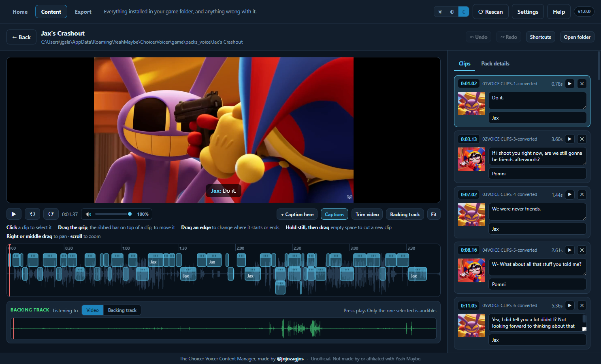
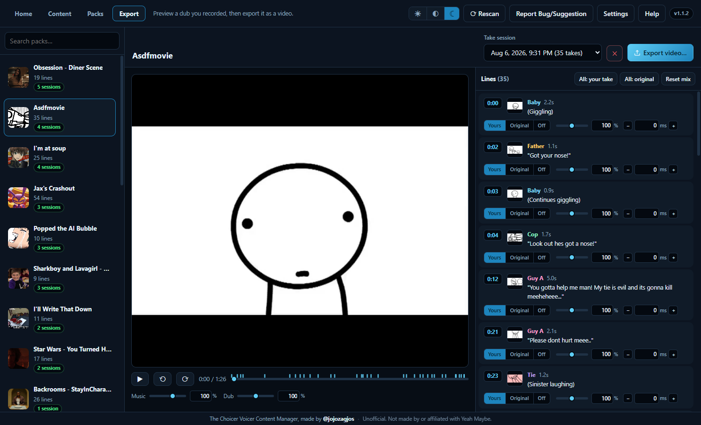
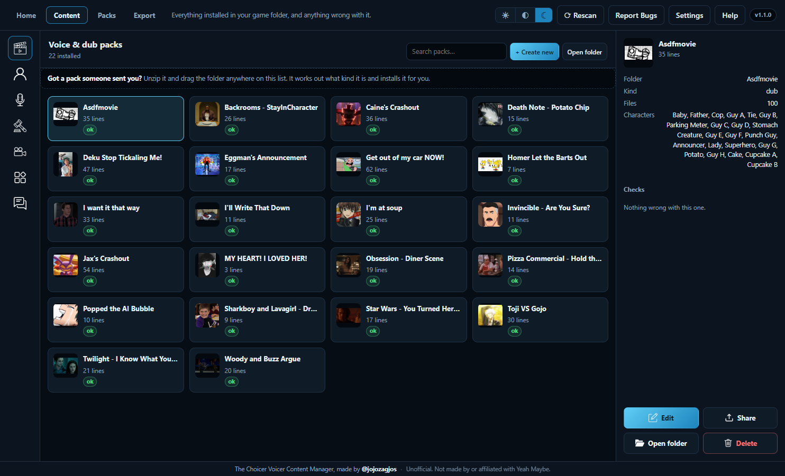
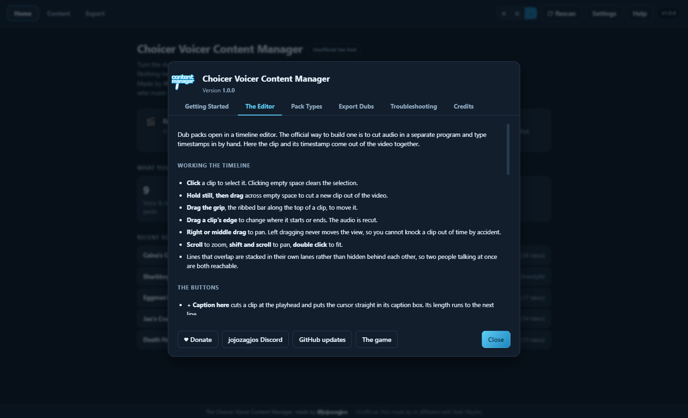
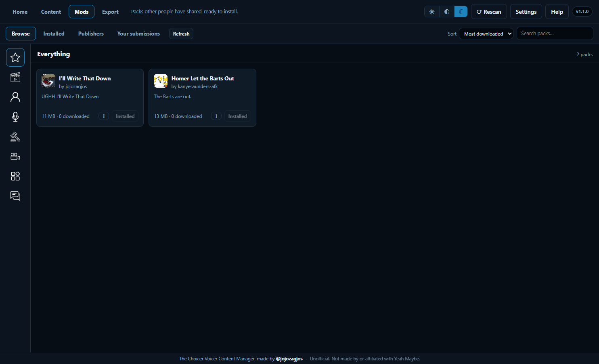
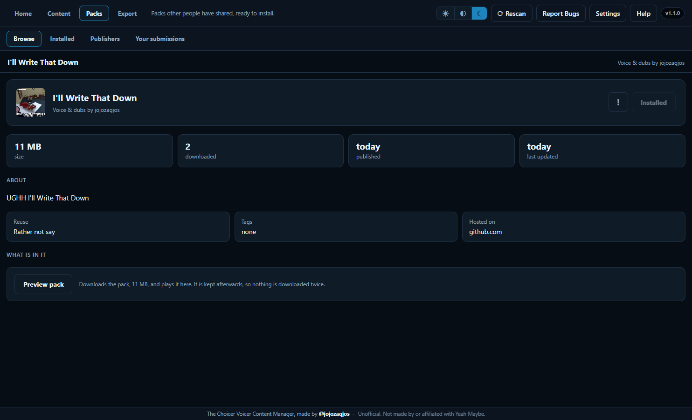

# Choicer Voicer Content Manager

An unofficial fan tool for [The Choicer Voicer](https://yeahmaybe.itch.io/the-choicer-voicer).

---

The Choicer Voicer records your dub takes and then leaves them sitting there as loose `.wav` files, with no
way to get them out. This app finds them, lays each one back over the pack's video and backing track
exactly where it belongs, and renders the result as a video you can actually share and save.

This app also builds all seven packs the game has, with a timeline editor for dub packs,
and it checks every pack against what the game will really load so you find out before the game
quietly ignores it.

## Screenshots

|||
|-|-|
|||
|**The dub editor.**|**Exporting.**|
|||
|**Your library.**|**Built-in help.**|
|||
|**Packs.** Packs other people have shared.|**Before you install.**|

## Getting it

1. [**Download the latest release**](https://github.com/jojozagjos/Choicer-Voicer-Content-Manager/releases/latest)
and unzip the folder.
2. Run **Choicer Voicer Content Manager.exe**.
3. Point it at your game folder when it asks.

> **Windows will show a blue "Windows protected your PC" box.** Click **More info**, then
> **Run anyway**. This happens because the app is not signed with a paid certificate, and because
> it reads and writes files it was not explicitly handed, which is the entire job: the packs and
> recordings belong to the game. Nothing leaves your computer, feel free to look through the open-source code.

## Turning a dub into a video

Open **Export**, pick a pack, and choose a recording session which you've already dubbed. You can press play to hear your takes over the original video, fix anything that sounds off, then export.

Per line you can:

* swap between your take, the original audio, or silence
* change its volume

Each character also has their own volume, in Settings next to their color. You can change the volume of individual characters.

You can export in `.mp4`, `.mkv`, `.mov`, or `.webm` with or without captions burnt in. You can also export a separate `.srt` file for the subtitles if you want them for some reason.

If a single line is way funnier than other ones, you're able to also export just that line.

## Building packs

### Timeline Editor

The normal method of creating a pack is to cut audio in a separate program, then name each audio clip with its timestamp by
hand, then type those timestamps back into the game.

Here you can just watch the video back, easily mark ranges, adding subtitles and character names if you want, and that's it.

You can:

* **Cut clips from the video**
* **Move and retime clips**
* **Caption over the video as it plays**
* **Trim the video**

### Backing tracks, built from the video

**There are three ways to create a backing track in the editor:**

**AI separate** uses [demucs-rs](https://github.com/nikhilunni/demucs-rs) and HTDemucs to split the
whole soundtrack into vocals, drums, bass and other, then rebuilds it without the vocal stem. This
is the cleanest option. *The first use downloads a pinned, verified native engine and model totaling
about 95 MB; audio is processed locally and is never uploaded.* It currently needs 64-bit Windows and
a Vulkan-capable graphics card.

**Muffle** is a no-download method for lower-end computers. It muffles the original video.

**Silence** removes the backing track completely, it is cleaner but it can sound like the audio dropped out when clips end.

How well any of these work depends on how the scene was mixed, but AI separation usually provides the best quality backing track.

It does take longer than the lightweight modes, especially on its first run.

### Every other pack type

Players, hosts, judges, studios, menus and chatter each have their own editors in the app.

### In-app File Conversion

You can in an `.mp4` where the game wants `.ogv`, or an `.m4a` where it wants `.wav`, and the app auto-converts
and renames it.

Pictures of a character are brought down to the size the game draws one at, so a render straight
out of an art program does not turn up several times too big. Backgrounds and overlays are left at
whatever size they were.

Got a pack someone sent you? Unzip it and drag the folder onto the library. It works out what kind
it is and installs it.

## Sharing packs

**Packs** lists what other people have made and uploaded. You can pick one and press **Install**; it
downloads, checks it against the checksum it was published with, refuses
anything malformed, and adds it to your library. Browsing and installing never
ask you to sign in or provide any of your information.

You can sort by most downloaded, newest, recently updated, name or size. **Publishers**
lists everyone with packs listed, and each of them has a page showing what they've made.

Selecting a pack opens its own page, with everything the listing says: what it
may be reused for, where it is hosted, its size, and when it was published and
last updated. **Preview pack** on that page plays it before you install it on your computer.
**Installed** lists everything you have downloaded from the community and tells you
which of them the author may have updated since. Packs are never replaced without being asked.

### Upload your packs

Open a pack in **Content** and press **Upload**. This gives you a `.zip` folder which contains the pack.

You can share this folder outside of the manager or continue on to upload it publicly with **Publish it**.

Publishing requires a
GitHub account, which you sign into once. Then:

* the pack is uploaded to **your own GitHub account**
* you are asked how it should be listed: name, one line about it, tags, and
whether other people may reuse it
* it appears in Packs once its checks pass, which takes a minute or two

**Your submissions** shows everything you have published along with the files included in each pack.

### What is and is not allowed

Every pack and publisher has a report button.

Packs can be marked as containing strong language, graphic violence, drug or
alcohol references, or flashing images.

Sexual content and nudity are not allowed to be listed at all.

## Choicer Voicer Game Folder

|OS|Path|
|-|-|
|Windows|`%APPDATA%\YeahMaybe\ChoicerVoicer\game`|

If your game folder is somewhere else, (a portable install or a copied save folder) direct the app to it in **Settings**.
Your settings, preview cache and undo bin live in your own user profile, not in the app folder, so
updating the manager keeps them. This is stored in `%APPDATA%\Choicer Voicer Content Manager`. Both the preview cache and the undo bin are kept to a
size limit on their own.

## If something goes wrong

|||
|-|-|
|**No packs listed**|Check **Settings** to see if the manager is finding the game folder.|
|**A pack says "no dubs yet"**|You have not recorded dubs yet. Do that in the game first.|
|**A pack will not open**|It is still converting.|
|**The preview is black**|Leave the preview and go back in. If it continues, use **Report Bug/Suggestions** in the app.|
|**Export failed**|Usually a full disk or a folder you cannot write to.|

There is a **Help** button in the app covering all of this in more detail, including what every
file in every pack type is for.

## Credits

Made by [**@jojozagjos**](https://github.com/jojozagjos).

**This is an unofficial fan tool.** It is not made by, affiliated with, endorsed by or supported by
**Yeah Maybe**, who made *The Choicer Voicer*. Please report problems here rather than to them.

*The Choicer Voicer*, its name and its artwork belong to Yeah Maybe. **No part of the game is
included in or redistributed by this repository or its releases.**

Content packs, and the audio, art and captions inside them, belong to whoever made them. Check with
a pack's author before publishing anything built from their work, and credit them when you do.

